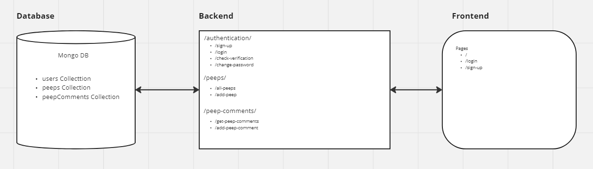

# Challenge 6 - Chitter FullStack
## Introduction

## Planning
### User stories

### Frontend and Backend tasks

### Connecting Diagram

### Component Hierarchy with state and api calls

## Proof of Prioritisation

## Proof of git tags

## Proof of AI
### Optimising/refactoring code

### Testing: Building more edge case tests

