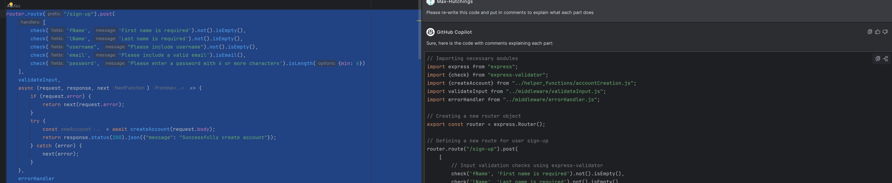

## Planning
### User stories

### Frontend and Backend tasks

### Connecting Diagram

### Component Hierarchy with state and API calls

# Proof of Prioritisation

# Proof of git tags
1

2

# Proof of AI
## Optimising/refactoring code
1

2

3

4

## Testing: Building more edge cases
1

## Testing: Generating tests and/or code for tests

## Testing: Identifying and generating further edge cases

## Improving code efficiency 

## Debugging
1

2

3

## For documenting code

